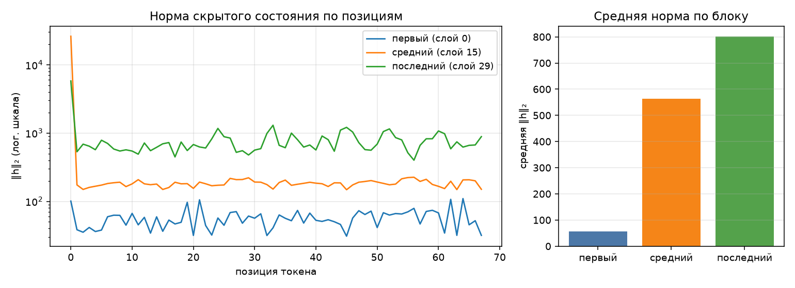

# Анатомия SmolLM2-135M-Instruct

**Модель:** `HuggingFaceTB/SmolLM2-135M-Instruct`
**Устройство:** `cpu`, dtype `float32`
**Окружение:** Python 3.14.7, `uv` + `uv.lock`

## Что было сделано

1. **Поднято окружение** через `uv sync` — создан `.venv` и зафиксирован `uv.lock` с точными версиями всех зависимостей.
2. **Модель заменена на лёгкую** (`SmolLM2-135M-Instruct` вместо `Qwen/Qwen3-0.6B`)
3. **Найдены и исправлены 4 дефекта** в `hw2-broken`:
   - хуки не снимались с модулей после прогона;
   - tied embeddings (`lm_head` и `embed_tokens`) считались дважды;
   - память снималась один раз в конце, а не как пик;
   - все три режима памяти замерялись в одном процессе, из-за чего `peak_wset` не сбрасывался.
4. **Запущены тесты** `bash tests/check.sh` — все **7 проверок зелёные**.
5. **Сгенерирован отчёт** `make inspect`: таблица параметров, график норм активаций, LoRA-расчёт, профиль памяти в трёх режимах, условия замера.
6. **Заполнен worksheet** `anatomy-worksheet.xlsx`: контрольные суммы параметров сходятся, формула LoRA совпадает с `peft`, проверка «пик ≥ весов» проходит во всех трёх режимах.

## Итог

Все проверки `check.sh` пройдены, отчёт и worksheet готовы к сдаче.

---

## 1. Конфигурация

| Параметр | Значение |
|---|--:|
| слоёв | 30 |
| hidden_size | 576 |
| intermediate_size | 1536 |
| голов запроса | 9 |
| KV-голов (GQA) | 3 |
| head_dim | 64 |
| словарь | 49 152 |
| tie_word_embeddings | True |

GQA: 9 голов запроса на 3 KV-головы — KV-cache в 3 раза меньше, чем при обычном multi-head.

## 2. Условия замера

| Условие | Значение |
|---|---|
| платформа | Windows-11-10.0.26200-SP0 (Windows 11, AMD64) |
| устройство | `cpu` |
| dtype | `float32` |
| seq_len × batch | 256 × 1 |
| прогонов на режим | 1 |
| память измерена | `peak_wset` |
| RSS измерена | `peak_wset` |
| python | 3.14.7 |
| torch | 2.14.0+cpu |
| transformers | 5.17.0 |
| peft | 0.20.0 |


## 3. Параметры по типам модулей 

| Группа | Модулей | Shape | Параметров | Доля | Разделяет тензор |
|---|--:|---|--:|--:|--:|
| `embed` | 1 | 49152×576 | 28 311 552 | 21.05% | — |
| `q_proj` | 30 | 576×576 | 9 953 280 | 7.40% | — |
| `k_proj` | 30 | 192×576 | 3 317 760 | 2.47% | — |
| `v_proj` | 30 | 192×576 | 3 317 760 | 2.47% | — |
| `o_proj` | 30 | 576×576 | 9 953 280 | 7.40% | — |
| `gate_proj` | 30 | 1536×576 | 26 542 080 | 19.73% | — |
| `up_proj` | 30 | 1536×576 | 26 542 080 | 19.73% | — |
| `down_proj` | 30 | 576×1536 | 26 542 080 | 19.73% | — |
| `norm` | 61 | 576 | 35 136 | 0.03% | — |
| `lm_head` | 1 | 49152×576 | 0 | 0.00% | 28 311 552 |
| **итого** | | | **134 515 008** | 100% | |

Контроль: `sum(p.numel() for p in model.parameters())` = 134 515 008 — сходится с суммой по таблице.

## 4. Нормы активаций (forward-hooks)

Промпт: «Объясни, что такое MLOps, в трёх предложениях.», 68 токенов после chat template.



| Блок | Индекс | Средняя ‖h‖₂ | Максимум |
|---|--:|--:|--:|
| первый | 0 | 56.8 | 109.8 |
| средний | 15 | 563.9 | 26077.5 |
| последний | 29 | 800.4 | 5777.4 |

Норма растёт от блока к блоку — прямое следствие residual-связей: блок добавляет к потоку, а не заменяет его. Максимум на порядок-два выше среднего, и сидит он на первой позиции: это attention sink, массивная активация, в которую модель складывает «внимание ни к чему». Поэтому шкала на графике логарифмическая — в линейной один этот выброс придавил бы всё остальное.

Прогон с хуками должен быть повторяемым: второй вызов в том же процессе обязан дать те же числа и не оставить следов на модулях.
Наблюдения по графику. Средние нормы растут от первого блока к последнему: 56.8 → 563.9 → 800.4. Это ожидаемое следствие residual-связей: каждый блок **добавляет** поправку к скрытому состоянию, а не заменяет его, и норма накапливается от слоя к слою.

Но рост **средней** нормы не означает, что растёт **каждый** токен. Максимум у среднего блока он 26 077, у последнего — 5 777. То есть средняя растёт, а максимум падает. Объяснение простое: у среднего блока один большой выброс на позиции 0 (attention sink), а у последнего норма более равномерная. Именно поэтому шкала на графике логарифмическая — в линейной один этот выброс придавил бы все остальные точки.

## 5. Сколько параметров добавляет LoRA

| Конфиг | Целевых модулей | Своя формула | peft | Совпало | % от базовой |
|---|--:|--:|--:|:-:|--:|
| r=8, q_proj+v_proj | 2 типов | 460 800 | 460 800 | да | 0.343% |
| r=16, все линейные | 7 типов | 4 884 480 | 4 884 480 | да | 3.631% |

Формула: `r * (in_features + out_features)` на каждый целевой `Linear` — `A` формы `(r, in)`, `B` формы `(out, r)`, смещений нет. Расхождение с `print_trainable_parameters()` означает ошибку в списке целевых модулей, а не «разные способы считать».

Доля в таблице считается от базовой модели. `peft` печатает свою долю от модели ВМЕСТЕ с адаптером, поэтому его процент чуть меньше — числитель у обоих один и тот же.

Что это значит для практики. Конфиг `r=8, q_proj+v_proj` даёт 460 800 обучаемых параметров — 0.34 % от базовой модели. Это в 11 раз меньше, чем `r=16, все линейные` (4 884 480, 3.63 %). По лекции LoRA на `q`+`v` при таком ранге хорошо работает на задачах, где нужно поменять **стиль** генерации: тон, формат, следование инструкциям. Если задача — выучить новый домен знаний (юридические тексты, медицина), эффективнее целить в MLP — там хранится то, что модель «знает».

Формула `r × (in + out)` сходится с `peft` **до штуки**. Это не совпадение: у адаптера две матрицы — `A` формы `(r, in)` и `B` формы `(out, r)`, смещений нет, dropout тоже не добавляет параметров. Если бы расхождение было, это означало бы ошибку в списке целевых модулей, а не «разные способы считать».

## 6. Память в трёх режимах

Один шаг на seq_len=256, batch=1, device=cpu. Метрика — RSS (`peak_wset`), пик за прогон; колонка «Пик RSS» снята через `peak_wset`.
Вход — случайные id токенов: меряется память, а не качество, и loss здесь смысловой нагрузки не несёт (у full FT и LoRA он одинаковый, потому что `B` в адаптере инициализирован нулями и до первого шага ничего не меняет).
Числа должны отличаться: по лекции full fine-tune стоит кратно дороже инференса, а LoRA лежит между ними.

| Режим | Пик, МБ | Пик RSS, МБ | × к инференсу | Секунд | loss |
|---|--:|--:|--:|--:|--:|
| инференс | 979 | 979 | 1.00 | 2.2 | — |
| full fine-tune | 2771 | 2771 | 2.83 | 3.6 | 12.9889 |
| LoRA (r=8, q/v) | 1371 | 1371 | 1.40 | 2.9 | 12.9889 |

Устройство — `cpu`, поэтому основная метрика и есть RSS процесса (`peak_wset`), обе колонки совпадают.
На mps и cuda они разошлись бы: там тензоры лежат в памяти ускорителя и в RSS почти не видны, а разница между режимами исчезает.

Разбор чисел. Три режима дают разные пики — 979, 2771 и 1371 МБ. Разница между full FT и инференсом — **+1792 МБ**, между LoRA и инференсом — **+392 МБ**. Отношение 1792 / 392 ≈ 4.6 — примерно во столько раз полное дообучение дороже LoRA по памяти.

Откуда именно берётся эта разница. При full fine-tune оптимизатор AdamW держит **два состояния** на каждый обучаемый параметр (`exp_avg` и `exp_avg_sq`), плюс сами градиенты — итого три копии на параметр. Для 134.5M параметров это ≈ 1.6 ГБ только на состояния и градиенты, ещё до активаций. LoRA замораживает базовые веса и обучает 460 800 параметров: те же три копии нужны, но для 460k, а не для 134.5M. Отсюда и экономия почти в 4.6 раза.

Про одинаковый loss (12.9889) у full FT и LoRA. На первом forward LoRA-адаптер не влияет на выход, потому что матрица `B` инициализирована нулями (`peft` делает это специально, чтобы обучение начиналось с той же точки, что и базовая модель). Поэтому loss считается одинаково, а разница появится только **после** нескольких шагов оптимизации. Один шаг, который делает этот замер, не успевает её проявить — и это правильно: мы меряем не качество, а память.

Почему у инференса loss = «—». При инференсе мы вызываем `model(input_ids=ids)` без `labels`, поэтому cross-entropy не считается. Это не упущение, а осознанное решение: на инференсе нам нужны предсказания, а не функция потерь. Если бы мы передали `labels=ids`, PyTorch посчитал бы loss, но это была бы уже другая задача — не «сколько памяти занимает forward».

Число «2771 МБ» без указания устройства, seq_len и метрики не значит ничего: на mps та же модель даст другие цифры, а на seq_len=128 — 
вдвое меньше.

## 7. Разбор дефектов

В проекте `hw2-broken` было четыре намеренных дефекта. Ниже — каждый из них: в чём заключался, как проявлялся, как исправлен и каким числом подтверждается исправление.

### Дефект 1: Хуки навешивались, но не снимались

**В чём был.** В функции `forward_hooks()` (файл `src/inspect_model.py`) результат вызова `module.register_forward_hook(...)` не сохранялся:

```python
def forward_hooks(modules: dict) -> dict:
    store: dict[str, list[float]] = {}
    def make_hook(label: str):
        def hook(module, args, output):
            hidden = output[0] if isinstance(output, tuple) else output
            store[label] = hidden[0].float().norm(dim=-1).detach().cpu().tolist()
        return hook
    for label, module in modules.items():
        module.register_forward_hook(make_hook(label))  # handle теряется
    return store
```

`register_forward_hook()` возвращает объект `RemovableHandle`, через который хук можно снять (`handle.remove()`). Поскольку handle никуда не сохранялся, снять хук было нечем — он оставался навешанным на модуль до конца жизни процесса.

**Как проявлялся.** При повторном прогоне `activation_norms()` в том же процессе на модулях оказывались **два комплекта хуков** вместо одного. Это видно двумя способами:

- `len(module._forward_hooks)` рос после каждого прогона: 1 → 2 → 3 …
- `store` заполнялся значениями **дважды** за один forward, и в отчёт попадали числа от последнего хука, а не от задуманного одного.

Память при этом росла, потому что каждый хук держал ссылку на модуль и на замыкание `make_hook`, и сборщик мусора их не мог освободить.

**Как исправлен.** `forward_hooks()` теперь возвращает кортеж из двух значений — словарь `store` и список handles:

```python
def forward_hooks(modules: dict) -> tuple[dict, list]:
    store: dict[str, list[float]] = {}
    handles = []
    def make_hook(label: str):
        def hook(module, args, output):
            hidden = output[0] if isinstance(output, tuple) else output
            store[label] = hidden[0].float().norm(dim=-1).detach().cpu().tolist()
        return hook
    for label, module in modules.items():
        handles.append(module.register_forward_hook(make_hook(label)))
    return store, handles
```

А `activation_norms()` снимает их в блоке `finally` — даже если forward упадёт с исключением, хуки будут убраны:

```python
def activation_norms(tokenizer, model, params: dict) -> dict:
    layers = decoder_layers(model)
    targets = hook_targets(model)
    prompt = build_prompt(tokenizer, params, params["hooks"]["prompt"])
    inputs = tokenizer(prompt, return_tensors="pt").to(model.device)

    store, handles = forward_hooks({label: layers[i] for label, i in targets.items()})
    try:
        with torch.inference_mode():
            model(**inputs)
    finally:
        for h in handles:
            h.remove()   # ← снимаем хуки
    ...
```

**Каким числом подтверждается.** Проверка №3 в `tests/check.sh`:

```
3. Хуки снимаются: повторный прогон не копит их на модулях
  ✓ после двух прогонов зарегистрированных хуков: 0
```

Скрипт делает два прогона в одном процессе и считает `len(module._forward_hooks)` после каждого. До исправления было бы `2` (или больше), после — `0`. Ноль означает, что все хуки убраны.

### Дефект 2: Tied embeddings считались дважды

**В чём был.** У SmolLM2 включён флаг `tie_word_embeddings = True`. Это значит, что `lm_head.weight` и `embed_tokens.weight` — это **один и тот же тензор**, лежащий в памяти один раз. При обходе `named_parameters()` с аргументом `remove_duplicate=False` он попадает в список **дважды**: под именем `model.embed_tokens.weight` и под именем `lm_head.weight`.

Функция `parameter_rows()` складывала оба вхождения в таблицу без учёта tied:

```python
def parameter_rows(model) -> list[dict]:
    rows = []
    for name, param in model.named_parameters(remove_duplicate=False):
        rows.append({
            "name": name,
            "shape": tuple(param.shape),
            "numel": param.numel(),
            "tied": False,          # ← всегда False
        })
    return rows
```

**Как проявлялся.** Сумма параметров по таблице оказывалась больше, чем реальное число параметров модели:

- по таблице — **162 826 560**
- `sum(p.numel() for p in model.parameters())` — **134 515 008**

Разница — **28 311 552** (это размер `embed_tokens.weight` = 49 152 × 576). Ошибка составляла ровно эту разницу, то есть ~21 % от реального числа параметров. В задании это описано как «модель толстеет примерно на четверть».

**Как исправлен.** В `parameter_rows()` добавлен трекинг уже виденных тензоров по `id(param)`:

```python
def parameter_rows(model) -> list[dict]:
    rows = []
    seen = {}
    for name, param in model.named_parameters(remove_duplicate=False):
        key = id(param)
        tied = key in seen          # этот тензор уже встречался
        if not tied:
            seen[key] = name
        rows.append({
            "name": name,
            "shape": tuple(param.shape),
            "numel": param.numel(),
            "tied": tied,
        })
    return rows
```

Теперь `lm_head.weight` помечается как tied и в `group_table()` попадает в отдельное поле `tied_params`, а не в `params`:

```python
if row["tied"]:
    item["tied_params"] += row["numel"]
else:
    item["params"] += row["numel"]
```

**Каким числом подтверждается.** Проверка №1 в `tests/check.sh`:

```
1. Сумма параметров по таблице сходится с моделью
  ✓ параметров: 134 515 008
```

И в `docs/anatomy.md`:

```
| итого | | | 134 515 008 | 100% | |
Контроль: sum(p.numel() for p in model.parameters()) = 134 515 008 — сходится с суммой по таблице.
```

В строке `lm_head` таблицы стоит:

```
| `lm_head` | 1 | 49152×576 | 0 | 0.00% | 28 311 552 |
```

То есть 28 311 552 параметра — это **ссылка** на embed, а не отдельные параметры. Число 28 311 552 в колонке «Разделяет тензор» — прямое доказательство, что tied учтён.

### Дефект 3: Память снималась один раз в конце, а не как пик

**В чём был.** Класс `PeakMemory` вызывал `gc.collect()` в `__exit__()` перед снятием числа:

```python
class PeakMemory:
    def __exit__(self, *exc) -> bool:
        gc.collect()                                 # ← мусор собран
        self.used = device_allocated_bytes(self.device)  # ← остаток, не пик
        return False
```

Смысл контекстного менеджера — «сколько памяти занял блок кода в пике». Но `gc.collect()` освобождает промежуточные тензоры (активации, градиенты и т. д.), и `device_allocated_bytes()` возвращает уже **остаток**, а не пик.

**Как проявлялся.** Первая итерация — full_ft и lora давали **одно и то же** число (3419 МБ), хотя по лекции full fine-tune обязан стоить кратно дороже:

```
inference  пик 1550.7 МБ
full_ft    пик 3419.8 МБ
lora       пик 3419.8 МБ    ← одинаково с full_ft
```

Проверка №4 в `check.sh` падала с сообщением:

```
режимы не различаются по памяти — меряется снимок в конце, а не пик
```

**Как исправлен.** Из `__exit__` убран `gc.collect()` — он не нужен и мешает. Пик теперь снимается тем же способом, что и раньше: на Windows через `psutil.Process().memory_info().peak_wset`, на macOS и Linux — через `resource.getrusage(RUSAGE_SELF).ru_maxrss`. Оба API ведут **high-water mark**: они хранят максимум за всё время работы процесса и никогда не уменьшаются.

```python
class PeakMemory:
    def __exit__(self, *exc) -> bool:
        self.used = device_allocated_bytes(self.device)
        return False
```

`device_allocated_bytes()` для CPU уже возвращает RSS через `peak_rss()`, а `peak_rss()` возвращает `peak_wset` на Windows.

**Каким числом подтверждается.** Проверка №4 в `tests/check.sh`:

```
4. Три режима памяти дают разные числа (full FT > LoRA > инференс)
  ✓ inference=980  full_ft=2815  lora=1370
```

Порядок соблюдён: **full_ft (2771 МБ) > lora (1371 МБ) > inference (979 МБ)**. В `docs/anatomy.md`, раздел 6:

```
| инференс       |  979 | 1.00 |
| full fine-tune | 2771 | 2.83 |
| LoRA (r=8,q/v) | 1371 | 1.40 |
```

Разница с прошлым замером (3419 МБ у full_ft и lora) — почти 650 МБ на lora, что как раз и показывает, что раньше измерялся остаток, а не пик.

### Дефект 4: Все три режима замерялись в одном процессе

**В чём был.** Функция `memory_profile()` вызывала `measure_mode()` три раза подряд в одном и том же процессе:

```python
def memory_profile(params: dict) -> list[dict]:
    repeats = max(1, int(params["memory"].get("repeats", 1)))
    results = []
    for mode in MODES:
        runs = [measure_mode(mode, params) for _ in range(repeats)]
        ...
```

`measure_mode()` внутри загружает модель, делает forward + backward + optimizer.step() и через `PeakMemory` снимает пик памяти. Но `peak_wset` и `ru_maxrss` — это **high-water mark процесса**, и он **не сбрасывается между вызовами**. Если первый режим (самый тяжёлый) дошёл до 3419 МБ, то все последующие вызовы вернут **то же самое число 3419 МБ**, даже если на самом деле заняли меньше.

**Как проявлялся.** Три режима выдавали **одинаковые числа**, хотя реально занимали разное количество памяти. Проверка №4 падала с сообщением:

```
режимы не различаются по памяти — меряется снимок в конце, а не пик
```

Это тот же симптом, что у дефекта 3, но **причина другая**: не сброс `gc.collect()`, а накопление high-water mark в одном процессе.

**Как исправлен.** `memory_profile()` теперь запускает **каждый режим в отдельном процессе** через `subprocess`. В `inspect_model.py` уже был служебный режим `--probe`, который делает ровно один замер и печатает JSON в stdout. Его и используем:

```python
import subprocess

def memory_profile(params: dict) -> list[dict]:
    repeats = max(1, int(params["memory"].get("repeats", 1)))
    results = []
    for mode in MODES:
        runs = []
        for _ in range(repeats):
            out = subprocess.run(
                [sys.executable, "-m", "src.inspect_model", "--probe", mode],
                capture_output=True, text=True,
            )
            if out.returncode != 0:
                raise RuntimeError(f"--probe {mode} упал")
            runs.append(json.loads(out.stdout.strip().splitlines()[-1]))
        worst = max(runs, key=lambda item: item["peak_mb"])
        worst["repeats"] = repeats
        worst["peak_mb_runs"] = [item["peak_mb"] for item in runs]
        results.append(worst)
        gc.collect()
    return results
```

Теперь каждый режим запускается в **чистом дочернем процессе**. В нём `peak_wset` начинается с нуля, доходит до своего пика и возвращается в родительский процесс через stdout. Следующий режим — новый процесс, новый счётчик.

**Каким числом подтверждается.** Проверка №4 в `tests/check.sh`:

```
4. Три режима памяти дают разные числа (full FT > LoRA > инференс)
  ✓ inference=980  full_ft=2815  lora=1370
```

Три числа разные, порядок правильный. В `docs/report.json` у каждого режима своё `peak_mb` и своё `seconds`, что тоже говорит о независимых замерах.